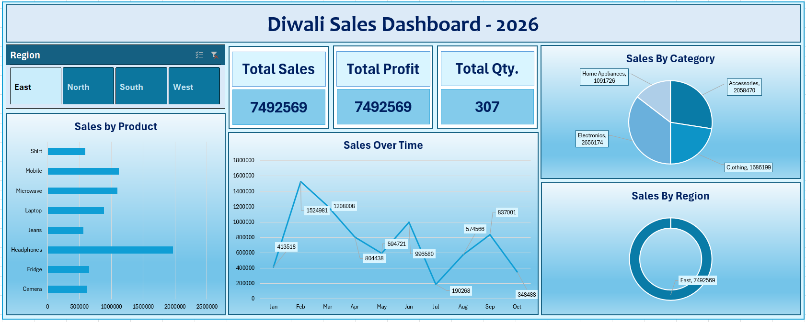

# 🪔 Diwali Sales Dashboard -- Microsoft Excel

An interactive **Diwali Sales Dashboard** created using **Microsoft
Excel** to analyze sales performance and convert raw sales data into
meaningful business insights.

This project was developed as part of my Data Analytics learning
journey, with a focus on **Excel data analysis, Pivot Tables, Pivot
Charts, KPIs, Slicers, and dashboard design**.

------------------------------------------------------------------------

## 📊 Dashboard Preview

------------------------------------------------------------------------

## 🎯 Project Objective

The main objective of this project was to build an interactive Excel
dashboard that provides a quick and clear overview of Diwali sales
performance.

The dashboard helps analyze:

-   Overall sales performance
-   Total profit generated
-   Total quantity sold
-   Sales performance by product
-   Sales performance by category
-   Sales performance by region
-   Sales trends over time
-   Regional sales comparison

------------------------------------------------------------------------

## 📌 Key Performance Indicators (KPIs)

The dashboard includes the following major KPIs:

  KPI                             Value
  ------------------------- -----------
  **Total Sales**             7,492,569
  **Total Profit**            7,492,569
  **Total Quantity Sold**           307

> KPI values are based on the data and dashboard version included in
> this project.

------------------------------------------------------------------------

## 📈 Dashboard Visualizations

### 1. Sales by Product

A horizontal bar chart is used to compare sales across different
products and identify products contributing significantly to overall
sales.

### 2. Sales Over Time

A line chart shows how sales change over the selected time period,
helping identify sales trends and fluctuations.

### 3. Sales by Category

A pie/donut-style visualization represents the contribution of different
product categories to total sales.

### 4. Sales by Region

A regional chart provides a quick comparison of sales performance across
different regions.

### 5. Region Slicer

An interactive slicer allows users to filter the dashboard by region,
making it easier to explore sales performance for individual regions.

------------------------------------------------------------------------

## 🛠️ Excel Skills & Features Used

This project helped me practice and apply several important Microsoft
Excel concepts:

-   **Pivot Tables**
-   **Pivot Charts**
-   **Slicers**
-   **KPI Cards**
-   **Data Aggregation**
-   **Data Filtering**
-   **Sales Trend Analysis**
-   **Category-wise Analysis**
-   **Region-wise Analysis**
-   **Dashboard Layout & Design**
-   **Data Visualization**
-   **Interactive Reporting**

------------------------------------------------------------------------

## 📂 Project Files

  -----------------------------------------------------------------------
  File                                Description
  ----------------------------------- -----------------------------------
  `SalesDataDashboard.xlsx`           Complete Excel dashboard and
                                      underlying sales analysis

  `DiwaliSalesDashboardImage.png`     Dashboard preview image
  -----------------------------------------------------------------------

------------------------------------------------------------------------

## 🔍 Key Insights

The dashboard was designed to make important sales information easy to
understand at a glance.

Using the dashboard, users can:

-   Identify high-performing products.
-   Compare sales across regions.
-   Understand category-wise sales contribution.
-   Track sales movement over time.
-   Filter the analysis by region.
-   Quickly monitor important sales KPIs.

------------------------------------------------------------------------

## 💡 Learning Outcomes

Through this project, I gained practical experience in:

1.  Working with sales data in Microsoft Excel.
2.  Creating and customizing Pivot Tables.
3.  Building interactive Pivot Charts.
4.  Using Slicers for dynamic filtering.
5.  Designing KPI cards for dashboard reporting.
6.  Choosing appropriate charts for different types of analysis.
7.  Organizing multiple visualizations into a clean dashboard.
8.  Turning raw data into a simple and understandable business report.

------------------------------------------------------------------------

## 📸 Dashboard Highlights

The dashboard combines multiple analytical components into a single
interactive view:

**KPIs → Product Analysis → Time Trend → Category Analysis → Regional
Analysis → Interactive Filtering**

This makes it possible to get a quick overview of sales performance
without manually analyzing the raw data.

------------------------------------------------------------------------

## 🚀 Future Improvements

Some possible improvements for future versions include:

-   Adding more detailed customer analysis
-   Adding profit margin analysis
-   Adding year/month/quarter filters
-   Adding Top N product analysis
-   Adding additional KPIs
-   Adding automated data refresh
-   Improving dashboard interactivity and navigation

------------------------------------------------------------------------

## 👨‍💻 About the Project

This is one of my early projects in my **Data Analytics learning
journey**. It gave me an opportunity to apply Excel concepts practically
instead of learning them only theoretically.

I am continuing to build more projects using **Excel, SQL, Power BI, and
Python** to strengthen my data analytics skills.

------------------------------------------------------------------------

## 🙏 Acknowledgement

Special thanks to **Chetan Sharma** for his continuous guidance and
support throughout my learning journey.

I am also grateful to **Adani Skill Development Centre** for providing a
valuable learning environment and platform to develop practical data
analytics skills.

------------------------------------------------------------------------

## 📚 Tools Used

**Microsoft Excel**

### Core Excel Features

`Pivot Tables` · `Pivot Charts` · `Slicers` · `KPI Cards` ·
`Data Visualization` · `Dashboard Design`

------------------------------------------------------------------------

⭐ If you find this project useful, feel free to explore the Excel file
and dashboard!
