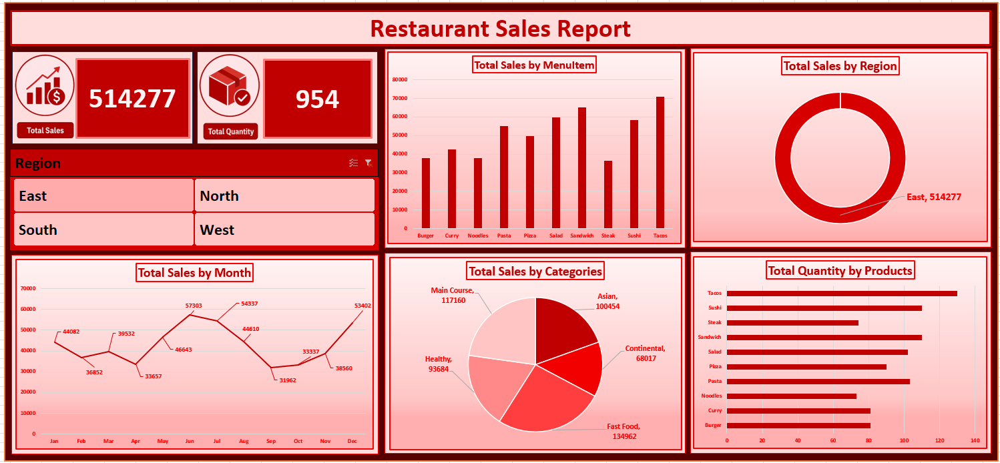

# 🍽️ Restaurant Sales Dashboard -- Microsoft Excel

An interactive **Restaurant Sales Dashboard** created using **Microsoft
Excel** to analyze restaurant sales data and present key business
insights through KPIs, charts, Pivot Tables, Pivot Charts, and
interactive slicers.

This project is part of my **Data Analytics learning journey**, where I
am building practical projects to strengthen my skills in **Excel, data
visualization, and business reporting**.

------------------------------------------------------------------------

## 📊 Dashboard Preview

------------------------------------------------------------------------

## 🎯 Project Objective

The objective of this project was to transform restaurant sales data
into an interactive and easy-to-understand dashboard.

The dashboard provides a consolidated view of sales performance and
allows users to explore the data through different dimensions such as
**menu items, regions, months, categories, and products**.

------------------------------------------------------------------------

## 📌 Key Performance Indicators (KPIs)

The dashboard highlights important business metrics at the top for quick
analysis:

  KPI                      Value
  -------------------- ---------
  **Total Sales**        514,277
  **Total Quantity**         954

These KPIs provide an immediate overview of the overall sales
performance.

------------------------------------------------------------------------

## 📈 Dashboard Visualizations

### 🍴 Sales by Menu Item

A column chart compares total sales across different menu items, making
it easier to identify the menu items contributing the most to revenue.

### 🌎 Sales by Region

A donut chart shows the distribution of total sales across different
regions and helps compare regional performance.

### 📅 Monthly Sales Trend

A line chart presents sales performance month by month, helping identify
trends, peaks, and fluctuations over time.

### 🏷️ Sales by Category

A pie chart represents sales contribution from different product
categories.

### 📦 Quantity by Product

A horizontal bar chart compares the quantity sold for individual
products and helps identify high-volume products.

### 🎛️ Interactive Region Slicer

The region slicer allows users to dynamically filter the dashboard and
analyze sales for specific regions.

------------------------------------------------------------------------

## 🛠️ Excel Skills & Features Used

This project helped me practice the following Microsoft Excel concepts:

-   **Pivot Tables**
-   **Pivot Charts**
-   **Slicers**
-   **KPI Cards**
-   **Data Aggregation**
-   **Data Filtering**
-   **Sales Trend Analysis**
-   **Menu Item Analysis**
-   **Category-wise Analysis**
-   **Region-wise Analysis**
-   **Product-wise Quantity Analysis**
-   **Data Visualization**
-   **Dashboard Design**
-   **Interactive Reporting**

------------------------------------------------------------------------

## 📂 Project Files

  -----------------------------------------------------------------------
  File                                Description
  ----------------------------------- -----------------------------------
  `Restaurant_Sales.xlsx`             Excel workbook containing the
                                      restaurant sales data and dashboard

  `RestaurantSalesDashboard.png`      Preview image of the completed
                                      dashboard
  -----------------------------------------------------------------------

------------------------------------------------------------------------

## 🔍 Key Insights

The dashboard makes it easier to understand restaurant sales performance
from multiple perspectives.

Using the dashboard, users can:

-   Identify high-performing menu items.
-   Compare sales between regions.
-   Analyze monthly sales trends.
-   Understand category-wise sales contribution.
-   Identify products with higher quantities sold.
-   Filter the report by region using the interactive slicer.
-   Monitor total sales and quantity through KPI cards.

------------------------------------------------------------------------

## 💡 Learning Outcomes

Through this project, I strengthened my practical understanding of:

1.  Preparing and analyzing sales data in Excel.
2.  Creating Pivot Tables for structured analysis.
3.  Building Pivot Charts for visual reporting.
4.  Using Slicers to create interactive dashboards.
5.  Designing KPI cards for quick business insights.
6.  Selecting suitable visualizations for different analytical
    questions.
7.  Combining multiple charts into a single dashboard.
8.  Presenting raw data in a clear and business-friendly format.

------------------------------------------------------------------------

## 📊 Dashboard Structure

The dashboard brings together several analytical views in one report:

**Total Sales & Quantity → Menu Item Analysis → Regional Analysis →
Monthly Trend → Category Analysis → Product Quantity Analysis**

This provides a simple way to move from high-level performance to
detailed sales analysis.

------------------------------------------------------------------------

## 🚀 Future Improvements

Possible improvements for future versions include:

-   Adding profit and profit-margin KPIs
-   Adding customer analysis
-   Adding Top 5 / Top 10 menu items
-   Adding year and quarter filters
-   Adding additional interactive slicers
-   Adding sales growth calculations
-   Adding automated data refresh
-   Improving dashboard navigation and interactivity

------------------------------------------------------------------------

## 👨‍💻 About the Project

This project is one of the practical projects I created while learning
**Data Analytics**.

Rather than focusing only on theoretical concepts, I am using
real-world-style datasets and dashboard projects to improve my ability
to analyze data and communicate insights effectively.

I am continuing to build projects using:

**Excel • SQL • Power BI • Python**

------------------------------------------------------------------------

## 🙏 Acknowledgement

A sincere thank you to **Chetan Sharma** for his continuous guidance and
support throughout my learning journey.

I am also grateful to **Adani Skill Development Centre** for providing
the opportunity to learn and build practical, industry-oriented
projects.

------------------------------------------------------------------------

## 📚 Tools Used

### Microsoft Excel

**Core Features:**

`Pivot Tables` · `Pivot Charts` · `Slicers` · `KPI Cards` ·
`Data Visualization` · `Dashboard Design`

------------------------------------------------------------------------

## ⭐ Project Status

**Completed**

This project represents another step in my journey toward becoming a
**Data Analyst**.

⭐ Feel free to explore the Excel workbook and dashboard preview!
