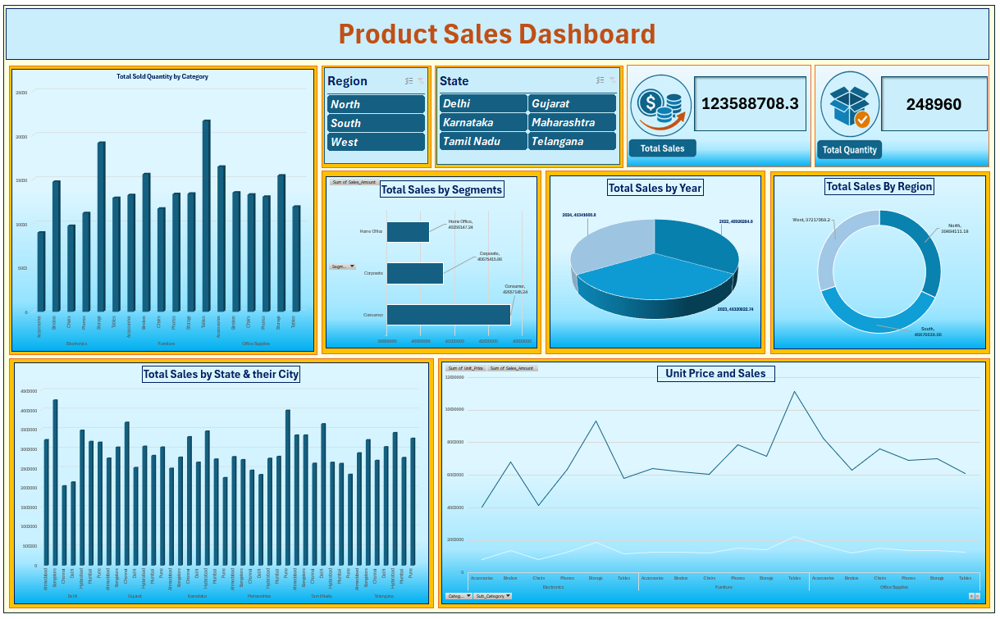

# 📊 Excel Data Modeling Dashboard | Product Sales Analysis

## 📌 Project Overview

This project is a **Product Sales Analysis Dashboard** created using **Microsoft Excel** by applying data modeling concepts.

Instead of working with a single dataset, multiple related tables were used to create a structured data model. Relationships between the tables were established to generate meaningful business insights through Pivot Tables, Pivot Charts, KPI Cards, and interactive Slicers.

---

## 📷 Dashboard Preview

  

---

## 📂 Dataset Information

The project uses multiple related tables to build a structured data model for analyzing product sales.

The analysis covers sales information across different dimensions such as:

- Region
- State
- City
- Category
- Segment
- Year

Using relationships between tables makes it possible to analyze the data from different perspectives while maintaining a structured and scalable data model.

---

## 🛠️ Tools & Technologies Used

- **Microsoft Excel**
- Data Modeling
- Relationships
- Pivot Tables
- Pivot Charts
- Slicers
- KPI Cards
- Data Analysis
- Data Visualization

---

## 📊 Key Highlights

### 🔗 Data Modeling

Created a structured data model using multiple related tables instead of relying on a single dataset.

### 🔄 Table Relationships

Established relationships between datasets to connect related information and support efficient analysis.

### 📊 Pivot Tables & Pivot Charts

Used Pivot Tables and Pivot Charts to summarize sales data and visualize important business metrics.

### 🎛️ Interactive Slicers

Added interactive Slicers to allow users to dynamically filter and explore the dashboard.

### 📌 KPI Cards

Created KPI Cards to display important metrics such as:

- Total Sales
- Total Quantity

### 🌍 Sales Analysis

Analyzed sales performance across different dimensions:

- Region
- State
- City
- Category
- Segment
- Year

---

## 📈 Dashboard Insights

The dashboard helps analyze product sales performance from multiple perspectives.

It provides a visual understanding of:

- Sales distribution across regions
- Sales performance by state and city
- Sales by product category
- Sales by customer segment
- Year-wise sales trends
- Overall sales and quantity performance

Interactive filters allow users to explore specific parts of the data and identify meaningful patterns.

---

## 🔄 Project Workflow

1. **Data Preparation**  
   Reviewed and prepared multiple datasets for analysis.

2. **Data Modeling**  
   Structured the datasets and established relationships between related tables.

3. **Data Analysis**  
   Used Excel's analytical features to explore sales performance.

4. **Pivot Table Creation**  
   Created Pivot Tables to summarize the modeled data.

5. **Visualization**  
   Developed Pivot Charts to represent key sales insights visually.

6. **Dashboard Development**  
   Combined KPI Cards, charts, and Slicers into an interactive dashboard.

---

## 📁 Project Files

| File | Description |
|------|-------------|
| `DataModeling.xlsx` | Excel workbook containing the data modeling and dashboard |
| `DataModelingProductDashboard.png` | Preview image of the Product Sales Dashboard |
| `data_modeling_training_dataset.xlsx` | Training dataset used for the analysis |

---

## 🎯 Skills Demonstrated

- Microsoft Excel
- Data Modeling
- Data Relationships
- Data Analysis
- Pivot Tables
- Pivot Charts
- Interactive Slicers
- KPI Development
- Data Visualization
- Dashboard Design
- Business Insights

---

## 💡 Key Learning

This project helped me understand how **proper data modeling improves data organization, simplifies analysis, and makes dashboards more interactive and scalable**.

Working with multiple related tables also provided practical experience in structuring data before performing analysis and visualization.

---

## 👨‍💻 Author

**Nitya Gohel**

Aspiring Data Analyst

---

## ⭐ Support

If you found this project useful, consider giving this repository a **star ⭐**.
