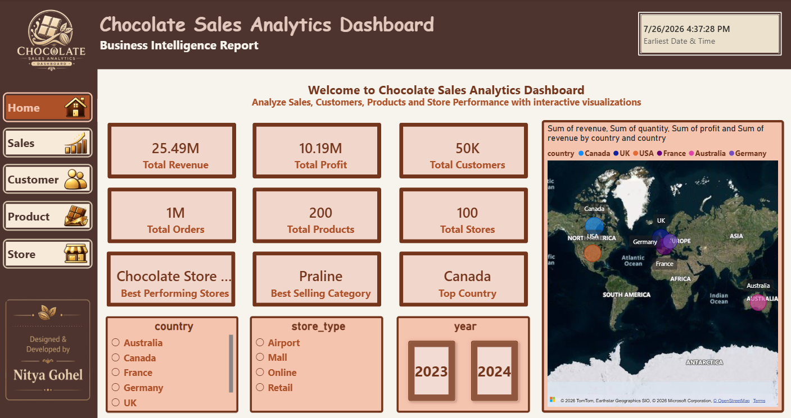
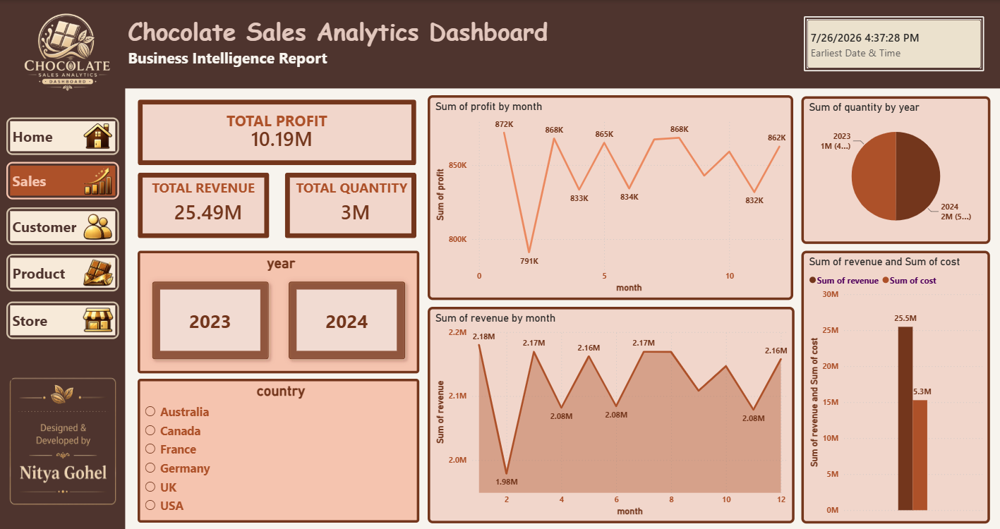
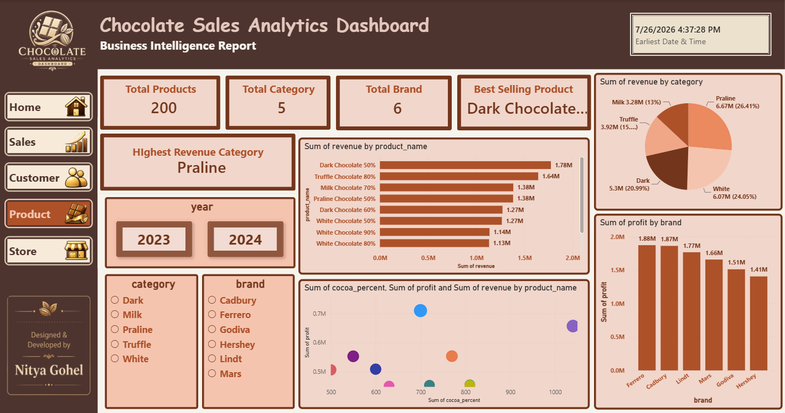
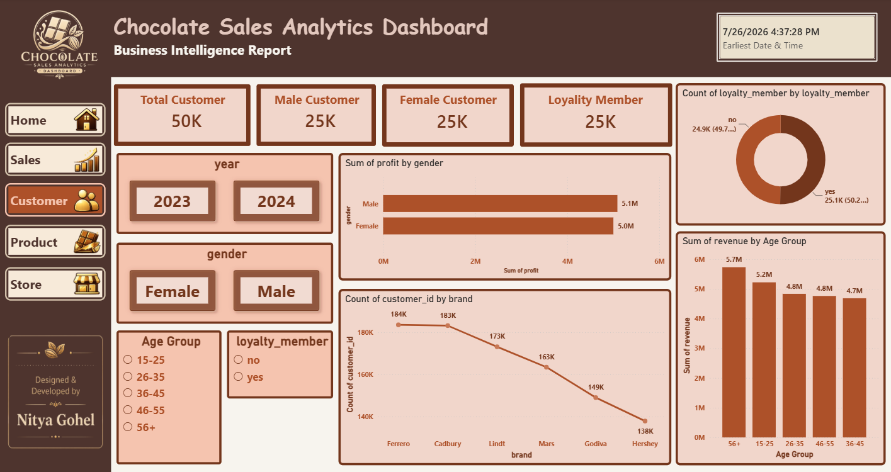
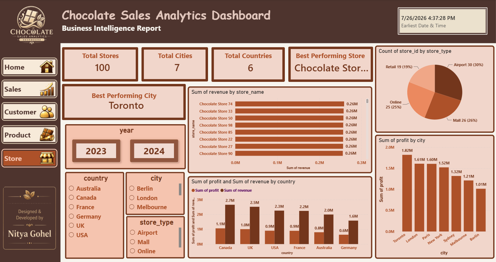

# Chocolate Sales Analytics Dashboard -- Power BI {#chocolate-sales-analytics-dashboard--power-bi}

An end-to-end **Chocolate Sales Analytics Dashboard** developed in
**Microsoft Power BI** to transform raw business data into meaningful
insights through interactive dashboards, data modeling, DAX, and
business-focused visualizations.

This project was created as part of my learning journey in **Data
Analytics at Adani Skill Development Centre**, with guidance and
feedback from **Chetan Sharma Sir**.

------------------------------------------------------------------------

## Project Overview

The dashboard provides a complete business view of chocolate sales
through five interactive pages:

1.  **Home Overview**
2.  **Sales Analysis**
3.  **Product Performance**
4.  **Customer Insights**
5.  **Store Performance**

The report uses a consistent chocolate-inspired UI theme and interactive
navigation to make the analysis easy to explore.

------------------------------------------------------------------------

## Dashboard Pages

### 1. Home Overview {#1-home-overview}

The Home page provides a high-level overview of the chocolate sales
business and acts as the main navigation page for the report.



------------------------------------------------------------------------

### 2. Sales Analysis {#2-sales-analysis}

The Sales page focuses on sales performance and business trends using
interactive charts, KPIs, filters, and visual analysis.



------------------------------------------------------------------------

### 3. Product Performance {#3-product-performance}

The Product page analyzes product-level performance, categories, brands,
and best-selling products to understand which products contribute most
to the business.



------------------------------------------------------------------------

### 4. Customer Insights {#4-customer-insights}

The Customer page provides insights into customer demographics, customer
segments, loyalty status, and purchasing behavior.



------------------------------------------------------------------------

### 5. Store Performance {#5-store-performance}

The Store page focuses on store-level performance and
geographical/business insights using interactive visualizations and
maps.



------------------------------------------------------------------------

## Key Highlights

-   Interactive multi-page Power BI dashboard with seamless navigation
-   Dynamic KPIs and DAX measures for business analysis
-   Star Schema data model with optimized relationships
-   Data cleaning and transformation using Power Query
-   Interactive slicers and filters for better user experience
-   Business-driven insights through charts and maps
-   Consistent chocolate-inspired dashboard theme
-   Clear and user-friendly dashboard layout
-   Analysis of sales, products, customers, and stores

------------------------------------------------------------------------

## Skills & Technologies {#skills--technologies}

### Power BI

-   Microsoft Power BI
-   Power BI Desktop
-   Power Query
-   DAX (Data Analysis Expressions)
-   Interactive Dashboards
-   Data Visualization

### Data Analytics

-   Data Cleaning & Transformation
-   Data Modeling
-   Star Schema
-   Relationships
-   KPI Development
-   Business Intelligence
-   Business-driven Data Analysis
-   Insight Generation

### Dashboard Design

-   Multi-page Dashboard Design
-   Page Navigation
-   Interactive Slicers
-   Filters
-   Charts & Maps
-   UI/UX-focused Dashboard Layout
-   Consistent Theme & Visual Design

------------------------------------------------------------------------

## Data Model

The project follows a **Star Schema** approach to organize the data and
create optimized relationships between fact and dimension tables.

The model was designed to support efficient analysis across:

-   Sales
-   Products
-   Customers
-   Stores
-   Categories
-   Brands
-   Other relevant business dimensions

------------------------------------------------------------------------

## Project Structure

``` text
ChocolateStoreDashboard/
│
├── DataSource/
│   └── Source data files
│
├── ChocolateSakesDashboard.pbix
│
├── Home.png
├── Sales.png
├── Product.png
├── Customer.png
└── Store.png
```

> **Note:** The Power BI file name follows the file currently uploaded
> to this repository: `ChocolateSakesDashboard.pbix`.

------------------------------------------------------------------------

## Tools Used

  Tool / Technology    Purpose
  -------------------- -----------------------------------------
  Microsoft Power BI   Dashboard development and visualization
  Power Query          Data cleaning and transformation
  DAX                  Measures, KPIs, and calculations
  Data Modeling        Star Schema and relationship design
  Charts & Maps        Business insight visualization

------------------------------------------------------------------------

## Learning Outcomes

This project helped me strengthen my practical understanding of:

-   Building end-to-end Power BI dashboards
-   Cleaning and transforming raw data
-   Designing a Star Schema data model
-   Creating DAX measures and dynamic KPIs
-   Using slicers, filters, charts, and maps
-   Creating interactive page navigation
-   Presenting data in a business-friendly format
-   Converting raw data into actionable business insights

------------------------------------------------------------------------

## Mentorship & Learning Journey {#mentorship--learning-journey}

A special thanks to **Chetan Sharma Sir** for his continuous guidance,
valuable feedback, and encouragement throughout the learning journey.

I am also grateful to **Adani Skill Development Centre** for providing a
practical learning environment and the opportunity to develop
industry-relevant data analytics skills.

------------------------------------------------------------------------

## Project Purpose

The main purpose of this project is to demonstrate how **Power BI, data
modeling, DAX, data transformation, and visualization** can be combined
to turn raw business data into an interactive analytical solution.

This project is part of my journey toward becoming a **Data Analyst**.

------------------------------------------------------------------------

## Author

**Nitya Gohel**

Aspiring Data Analyst \| Python \| SQL \| Machine Learning \| AI

------------------------------------------------------------------------

## Feedback

Feedback and suggestions are welcome. They can help improve both the
dashboard and my data analytics skills.
