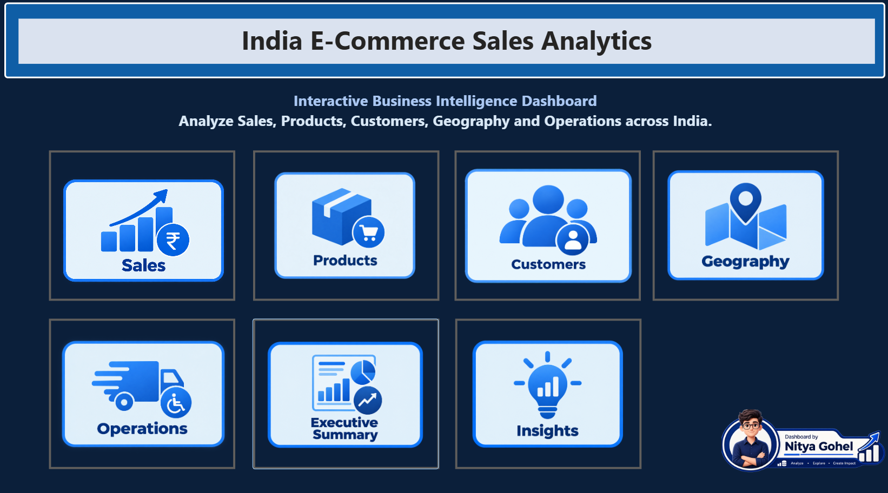
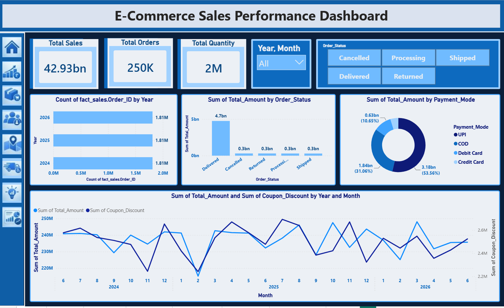
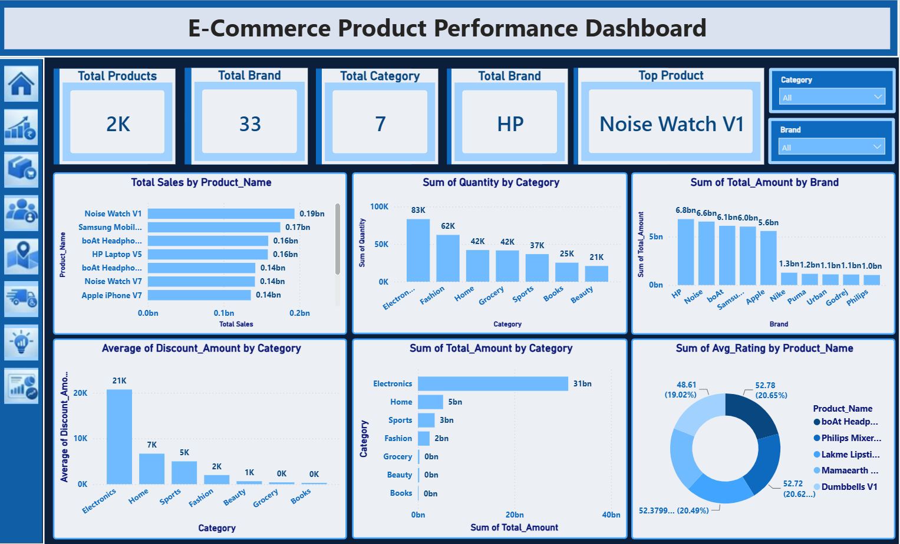
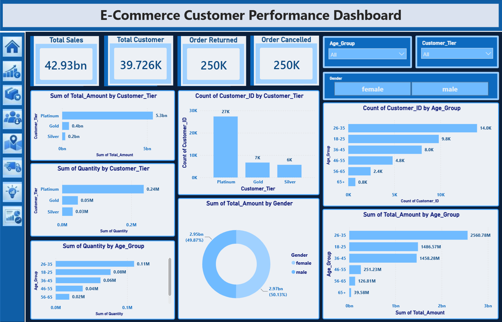
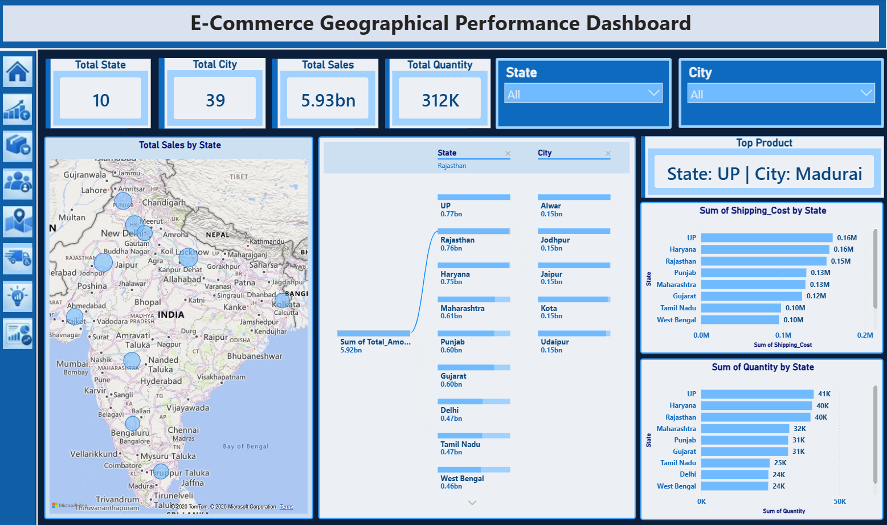
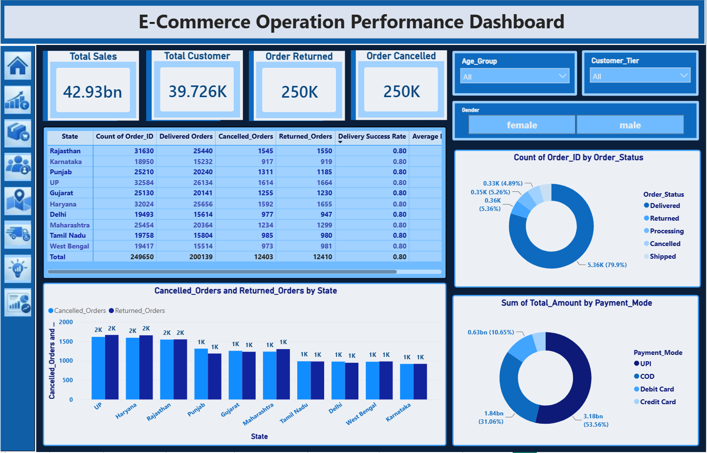
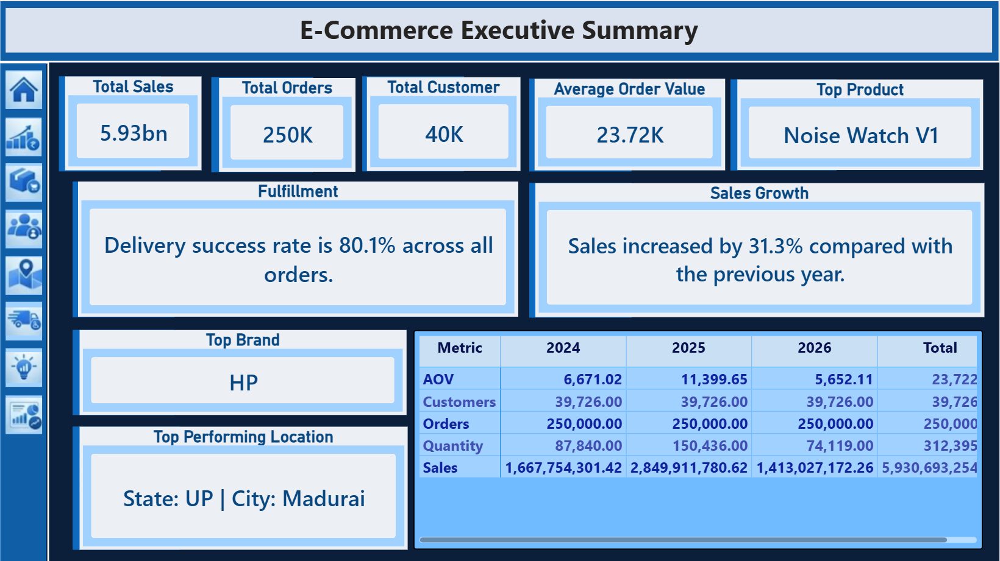
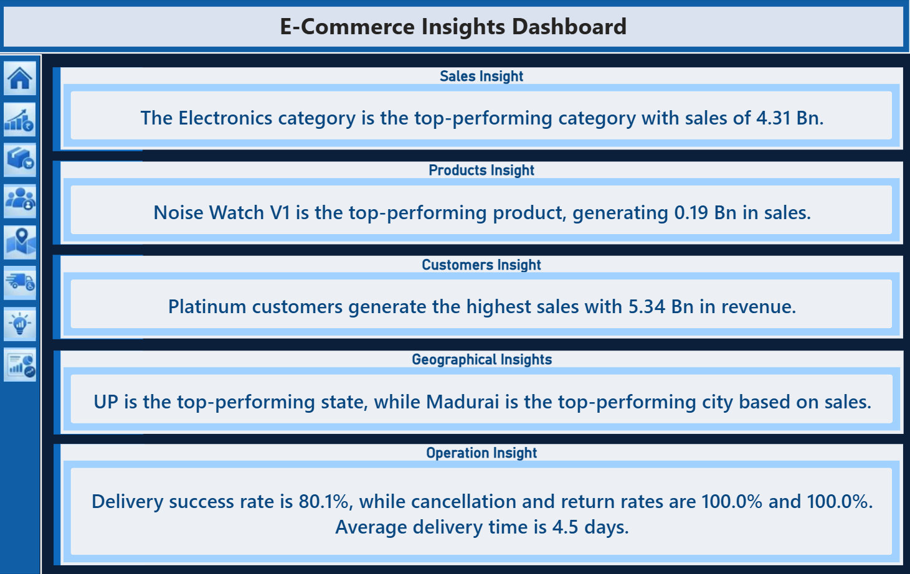

# 📊 India E-Commerce Sales Analytics Dashboard

> An interactive **Power BI Business Intelligence dashboard** designed to analyze e-commerce sales, customers, products, geography, and operational performance across India.

## 🖥️ Dashboard Preview

<p align="center">
  
</p>

<p align="center">
  <b>Interactive Home Dashboard</b> — Navigate between Sales, Products, Customers, Geography, Operations, Executive Summary, and Insights.
</p>

---

## 📌 Project Overview

The **India E-Commerce Sales Analytics Dashboard** converts e-commerce data into interactive business insights using Microsoft Power BI.

The dashboard provides a centralized view of:

- 💰 Sales performance
- 🛒 Order and quantity analysis
- 👥 Customer performance
- 📦 Product and brand performance
- 🗺️ State and city-wise geographical analysis
- 🚚 Delivery and order operations
- 💳 Payment method analysis
- 📈 Sales trends and growth
- 💡 Automated business insights
- 📋 Executive-level KPI summary

The project is designed to make it easy to explore the data using **interactive filters, slicers, charts, KPIs, and navigation buttons**.

---

## 📊 Dashboard Pages

### 1. 🏠 Home Dashboard

The Home page acts as the main navigation screen for the project.

It provides quick access to:

- Sales
- Products
- Customers
- Geography
- Operations
- Executive Summary
- Insights

---

### 2. 💰 Sales Performance Dashboard

<p align="center">
  
</p>

The Sales dashboard focuses on overall sales and order trends.

**Key analysis:**
- Total Sales
- Total Orders
- Total Quantity
- Year and Month filtering
- Order Status analysis
- Payment Mode analysis
- Year-wise order volume
- Monthly sales and coupon-discount trends

**Interactive features:**
- Year/Month slicer
- Order Status buttons
- Interactive charts that respond to selections

---

### 3. 📦 Product Performance Dashboard

<p align="center">
  
</p>

The Product dashboard analyzes product, category, and brand performance.

**Key analysis:**
- Total Products
- Total Brands
- Total Categories
- Top Brand
- Top Product
- Product-wise sales
- Category-wise quantity
- Brand-wise sales
- Category-wise discount amount
- Category-wise sales
- Product rating analysis

**Interactive filters:**
- Category
- Brand

---

### 4. 👥 Customer Performance Dashboard

<p align="center">
  
</p>

The Customer dashboard provides insights into customer segments and purchasing behavior.

**Key analysis:**
- Total Sales
- Total Customers
- Returned Orders
- Cancelled Orders
- Customer Tier analysis
- Age Group analysis
- Gender-wise sales
- Customer count by tier
- Quantity by customer tier
- Sales by age group

**Interactive filters:**
- Age Group
- Customer Tier
- Gender

---

### 5. 🗺️ Geographical Performance Dashboard

<p align="center">
  
</p>

The Geographical dashboard analyzes sales performance across Indian states and cities.

**Key analysis:**
- Total States
- Total Cities
- Total Sales
- Total Quantity
- State-wise sales
- City-wise sales
- Shipping cost by state
- Quantity by state
- Top-performing location
- Map-based geographical analysis

**Interactive filters:**
- State
- City

---

### 6. 🚚 Operation Performance Dashboard

<p align="center">
  
</p>

The Operations dashboard focuses on order fulfillment and operational performance.

**Key analysis:**
- Total Sales
- Total Customers
- Returned Orders
- Cancelled Orders
- State-wise order performance
- Delivered, Cancelled, Returned, Processing and Shipped orders
- Delivery success rate
- Cancelled vs Returned orders
- Payment mode analysis

**Interactive filters:**
- Age Group
- Customer Tier
- Gender

---

### 7. 📋 Executive Summary

<p align="center">
  
</p>

The Executive Summary provides a high-level business view for quick decision-making.

**Key KPIs and insights include:**
- Total Sales
- Total Orders
- Total Customers
- Average Order Value
- Top Product
- Delivery Success Rate
- Sales Growth
- Top Brand
- Top Performing Location
- Year-wise KPI comparison

---

### 8. 💡 Business Insights

<p align="center">
  
</p>

The Insights page converts dashboard results into easy-to-understand business statements.

It highlights:

- Top-performing category
- Top-performing product
- Highest-value customer tier
- Top-performing state and city
- Delivery performance
- Cancellation and return performance
- Average delivery time

---

## 🎯 Key Business Insights

Based on the dashboard:

| Area | Key Insight |
|---|---|
| 🛍️ Category | Electronics is the top-performing category |
| 📦 Product | Noise Watch V1 is the top-performing product |
| 👥 Customers | Platinum customers generate the highest sales |
| 🗺️ Geography | UP is the top-performing state |
| 📍 City | Madurai is highlighted as the top-performing city |
| 🏷️ Brand | HP is shown as the top brand |
| 🚚 Operations | Delivery success rate is approximately 80.1% |
| 📈 Sales | The Executive Summary shows 31.3% sales growth compared with the previous year |

---

## 🛠️ Tools & Technologies

- **Microsoft Power BI**
- **Power Query**
- **DAX**
- **Data Visualization**
- **Interactive Slicers & Filters**
- **KPI Cards**
- **Maps**
- **Bar Charts**
- **Donut Charts**
- **Line Charts**
- **Tables & Matrix Visuals**
- **Power BI Page Navigation**

---

## 📁 Project Structure

```text
India-E-Commerce-Sales-Analytics/
│
├── Data Source/
│
├── ECommerceData.pbix
│
├── Home.png
├── Sales.png
├── Products.png
├── Customers.png
├── Geographical.png
├── Operations.png
├── Executive_Summary.png
├── Business_Insights.png
│
└── README.md
```

---

## 🔎 Interactivity

The dashboard is designed as an interactive Power BI report rather than a collection of static charts.

Users can:

1. Select a dashboard page from the navigation menu.
2. Apply slicers such as **Year, Month, State, City, Category, Brand, Age Group, Customer Tier, and Gender**.
3. Click chart elements to cross-filter related visuals.
4. Compare sales, customers, products, locations, and operations.
5. Use the Executive Summary for a quick management-level overview.
6. Use the Insights page to understand the most important business findings.

---

## 📈 Dashboard Highlights

### Sales
- Overall sales and order monitoring
- Monthly and yearly trends
- Order status distribution
- Payment mode contribution

### Products
- Top products and brands
- Category performance
- Quantity and sales comparison
- Rating and discount analysis

### Customers
- Customer tier segmentation
- Age group analysis
- Gender-wise sales
- Customer quantity and revenue analysis

### Geography
- State and city performance
- Interactive India map
- Shipping cost comparison
- Top-performing locations

### Operations
- Delivery performance
- Cancelled and returned orders
- Order-status distribution
- State-wise operational analysis

### Executive View
- High-level KPIs
- Sales growth
- Top product and brand
- Top location
- Delivery success rate

---

## 🚀 How to Use

1. Clone or download this repository.
2. Open `ECommerceData.pbix` using **Microsoft Power BI Desktop**.
3. Make sure the required data source is available in the `Data Source` folder.
4. Refresh the data if required.
5. Use the navigation buttons to explore each dashboard page.
6. Apply filters and interact with charts to analyze different business segments.

---

## 👨‍💻 Author

**Nitya Gohel**

📊 Data Analytics & Business Intelligence Project

---

## ⭐ Project Goal

The main goal of this project is to transform raw e-commerce data into a **clear, interactive, and decision-oriented Business Intelligence dashboard** that helps users understand sales performance, customer behavior, product trends, geographical performance, and operational efficiency.

If you find this project useful, consider giving the repository a ⭐.
