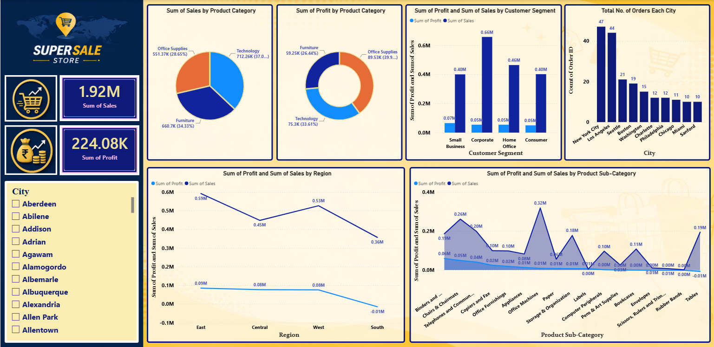

# 📊 Power BI Dashboard \| Super Store Sales Analysis

## 📌 Project Overview

This project presents an interactive **Power BI Dashboard** developed
using the **Super Store Sales dataset**.

The main objective of this dashboard is to transform raw sales data into
meaningful business insights through interactive visualizations and
data-driven analysis. It helps users explore key business metrics,
understand sales trends, compare product performance, and support
informed decision-making.

## 🔍 Key Insights Included

-   💰 Total Sales and Total Profit Overview
-   📦 Sales Analysis by Product Category
-   📈 Profit Analysis by Product Category
-   👥 Customer Segment Performance
-   📊 Regional Sales and Profit Comparison
-   🏆 Product Sub-Category Performance Analysis
-   🌎 Top Cities by Number of Orders
-   🎛️ Interactive City Filter for Dynamic Exploration

## 🛠️ Skills & Technologies

While building this project, I enhanced my practical skills in:

-   **Power BI**
-   **Power Query**
-   **Data Modeling**
-   **DAX**
-   **Data Visualization**
-   **Dashboard Design**
-   **Business Intelligence**

## 📷 Dashboard Preview

The dashboard provides an interactive view of sales, profit, product
categories, customer segments, cities, and sub-category performance.

> **Note:** The preview image is loaded directly from
> `SuperSalesUSDashboard.png` in this GitHub folder.

## 🎯 Project Objective

The dashboard was created to demonstrate how raw business data can be
converted into clear and actionable insights using Power BI.

It focuses on:

-   Identifying sales and profit trends
-   Comparing product and category performance
-   Understanding customer and regional performance
-   Highlighting high-performing cities and products
-   Presenting business information through an easy-to-use interactive
    dashboard

## 🙏 Acknowledgement

I would like to express my sincere gratitude to **Chetan Sharma** for
his continuous guidance, valuable mentorship, and practical approach to
teaching, which played a significant role in completing this project.

I also extend my sincere thanks to **Adani Skill Development Centre**
for providing an excellent learning environment and the opportunity to
strengthen my skills in **Power BI and Data Analytics**.

## 🚀 Learning Outcome

This project helped me improve my analytical and visualization skills
and gave me practical experience in solving real-world business problems
using data.

I am continuously working on improving my skills in **Data Analytics,
Business Intelligence, Power BI, and Data Visualization**.

## 💬 Feedback

I welcome your feedback and suggestions.

------------------------------------------------------------------------

### 🔗 Connect & Explore

If you found this project useful or interesting, feel free to explore my
other **Data Analytics and Power BI projects** on my GitHub profile.

**#PowerBI #DataAnalytics #BusinessIntelligence #DataVisualization
#Dashboard #MicrosoftPowerBI #DAX #PowerQuery #DataAnalyst #Analytics
#BusinessAnalytics #Learning #DataDriven #CareerGrowth #PowerBIProject**
